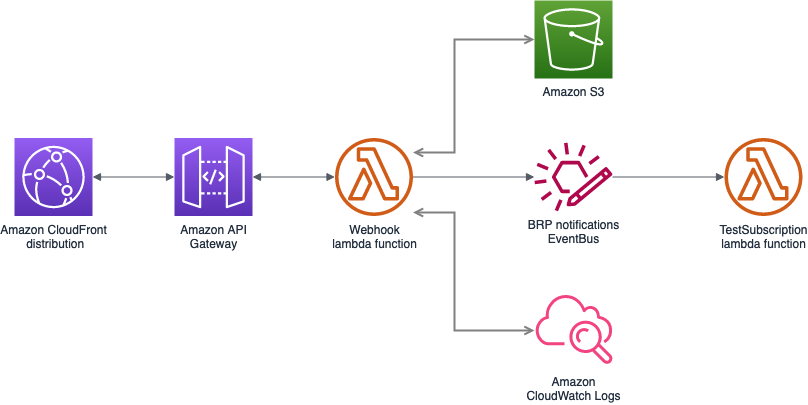

# Notificaties vanuit BRP
Deze applicatie handelt de notificaties die vanuit BRP komen af en slaat deze op.

## Replay van events
Omdat te technische keuzes die gemaakt worden voor het afhandelen van de BRP notificaties nog niet vast liggen is het wenselijk berichten opnieuw te kunnen afspelen. Hiertoe zijn twee replay mechanismes ingebouwd:
1. Requests opslaan in s3 bucket - De webhook lambda slaat elk binnenkomend request op in een s3 bucket. Deze requests kunnen worden uitgelezen (nog te implementeren) en opnieuw worden afgehandeld.
2. EventBridge replay - De webhook publiceert de berichten ook als events op een EventBridge event bus. Deze requests worden gearchived door EventBridge. EventBridge bied ook een replay optie. 

Onderstaand diagram geeft de huidige architectuur weer.
